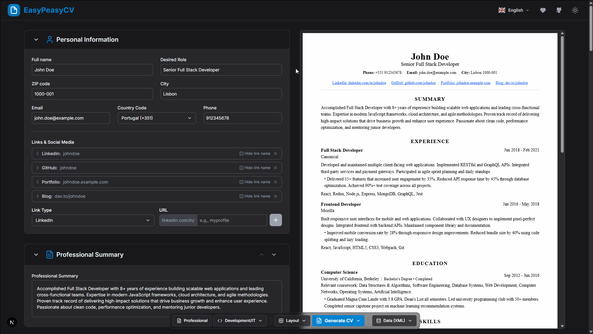

<div align="center">
  
  <h1>EasyPeasyCV</h1>

  <a href="https://github.com/goncalojbsousa/EasyPeasyCV/stargazers">
    
  </a>
  <a href="https://github.com/goncalojbsousa/EasyPeasyCV/network/members">
    
  </a>
  <a href="https://github.com/goncalojbsousa/EasyPeasyCV/issues">
    
  </a>
  <a href="https://github.com/goncalojbsousa/EasyPeasyCV/blob/main/LICENSE">
    
  </a>
  <a href="https://www.easypeasycv.com/">
    
  </a>

  <p>A modern, open source resume builder designed for professionals who value privacy, flexibility, and control over their data. Create high-quality, ATS-friendly CVs directly in the browser — no registration or server required.</p>

  
</div>

## Why EasyPeasyCV?

EasyPeasyCV was built to solve a common problem: most online CV builders either require user registration, store personal data on external servers, or offer limited customization. This project provides a truly private, client-side solution that empowers users to design, edit, and export their resumes with full control and transparency.

- **100% Private:** All data is processed and stored locally in your browser. No accounts, no tracking, no data leaves your device.
- **Open Source:** The codebase is public and contributions are welcome.
- **Professional Results:** Export resumes as high-quality PDFs, optimized for Applicant Tracking Systems (ATS).
- **Flexible Layouts:** Multiple templates and deep layout customization options.
- **Internationalization:** Available in English, Portuguese, Brazilian Portuguese, and Spanish.

## Key Features

- **Real-Time Editing:** Instantly preview your CV as you edit, with changes reflected live.
- **Multiple Templates:** Choose from several professionally designed templates, each with unique visual styles.
- **Advanced Layout Controls:** Adjust text alignment, font, spacing, margins, section order, and more.
- **Custom Sections:** Add your own sections and fields to tailor your resume to any industry or role.
- **Section and Entry Reordering:** Change the order of sections and entries using intuitive arrow controls for maximum impact.
- **Data Import & Export:** Save your CV data as XML for backup or migration, and restore it at any time.
- **PDF Export:** Generate print-ready, ATS-compatible PDFs directly in the browser.
- **Multi-Language Support:** Switch languages at any time; your preference is saved locally.
- **Offline-First:** All features work without an internet connection after the initial load.

## Privacy by Design

EasyPeasyCV never sends your data to any server. All information is stored in your browser's local storage and processed client-side. You can export or delete your data at any time. No analytics, no cookies, no hidden data collection.

## Getting Started

1. **Clone the repository:**
    ```bash
    git clone https://github.com/goncalojbsousa/EasyPeasyCV.git
    cd EasyPeasyCV
    ```
2. **Install dependencies:**
    ```bash
    npm install
    ```
3. **Start the development server:**
    ```bash
    npm run dev
    ```
4. Open [http://localhost:3000](http://localhost:3000) in your browser.

### How to Contribute

1. Fork the repository
2. Create a feature branch
3. Make your changes and test locally
4. Run linting with [Biome](https://biomejs.dev/) and ensure all checks pass:
    ```bash
    npx biome check
    ```
5. Submit a pull request with a clear description

## Tech Stack

- **Framework:** Next.js 15 (App Router)
- **Language:** TypeScript
- **Styling:** Tailwind CSS
- **PDF Generation:** @react-pdf/renderer

## Project Architecture

- `app/`
  - `[locale]/`: Internationalized routes
    - `builder/page.tsx`: Main CV builder page
    - `privacy/page.tsx`, `terms/page.tsx`, etc.
    - `layout.tsx`, `not-found.tsx`, `page.tsx`
  - `components/`: Shared components
    - `cv_templates/`: PDF-ready resume templates (Classic, Professional, Timeline)
    - `dnd/`: Drag and drop
    - `features/`: CV sections
    - `layout/`: Navbar, Footer
    - `pdf/`: PDF preview/download
    - `ui/`: Reusable UI elements
  - `contexts/`: React contexts
  - `translations/`: i18n translation files (br, en, es, pt)
  - `types/`: Shared TypeScript types
  - `utils/`: Helpers and hooks
  - `globals.css`: Global CSS
  - `robots.ts`, `sitemap.ts`: SEO
- `public/`: Static assets
- `i18n/`: Internationalization utilities
- `types/`: External types (e.g., pdfjs-dist.d.ts)
- **Root configs:** `next.config.ts`, `tailwind.config.ts`, `postcss.config.mjs`, `biome.json`, `tsconfig.json`, `package.json`

## License

EasyPeasyCV is released under the MIT License. See the [LICENSE](LICENSE) file for details.

## Links

- [Live Website](https://www.easypeasycv.com/)
- [GitHub Repository](https://github.com/goncalojbsousa/EasyPeasyCV)
- [Issue Tracker](https://github.com/goncalojbsousa/EasyPeasyCV/issues)